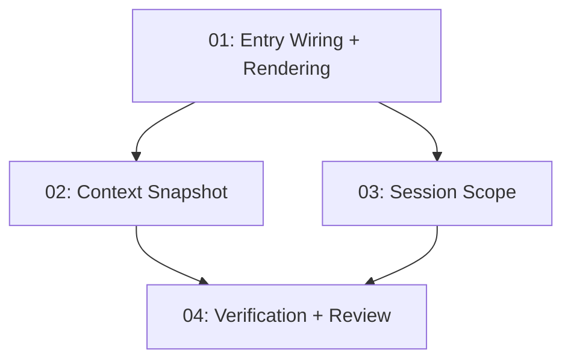

# Implementation Plan: Ask Prism Reliability + Grounded Context

**Created:** 2026-02-27
**Status:** Completed
**Total Features:** 4
**Completed:** 4/4

## Progress Summary

| ID | Feature | Status | Dependencies | Priority |
|----|---------|--------|--------------|----------|
| 01 | Ask Prism entry wiring + route rendering fix | ✅ Completed | - | High |
| 02 | Unified Ask Prism context snapshot enrichment | ✅ Completed | 01 | High |
| 03 | Hybrid session scope management | ✅ Completed | 01, 02 | High |
| 04 | Verification + code review passes | ✅ Completed | 01, 02, 03 | High |

## Dependency Graph

