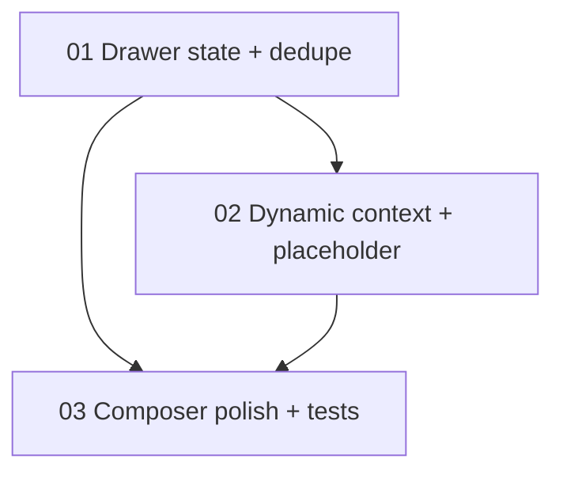

# Implementation Plan: Ask Prism UX Refinement

**Created:** 2026-02-27
**Status:** Completed
**Total Features:** 3
**Completed:** 3/3

## Progress Summary

| ID | Feature | Status | Dependencies | Priority |
|----|---------|--------|--------------|----------|
| 01 | Drawer state + prompt dedupe | ✅ Completed | - | High |
| 02 | Dynamic context card + placeholder strategy | ✅ Completed | 01 | High |
| 03 | Composer visual refresh + navigation chip polish + tests | ✅ Completed | 01, 02 | High |

## Dependency Graph

