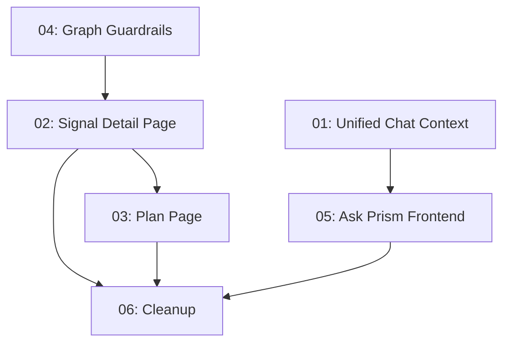

# Implementation Plan: Calm Intelligence UI Redesign

**Created:** 2026-02-26
**Status:** Not Started
**Total Features:** 6
**Completed:** 0/6

## Progress Summary

| ID | Feature | Status | Dependencies | Priority |
|----|---------|--------|--------------|----------|
| 01 | Unified Ask Prism Chat Context (Backend) | ⬜ Not Started | - | High |
| 02 | Signal Detail Page | ⬜ Not Started | 04 | High |
| 03 | Plan Page | ⬜ Not Started | 02 | High |
| 04 | Causal Graph Readability Guardrails | ⬜ Not Started | - | High |
| 05 | Ask Prism Slide-Over Frontend Upgrade | ⬜ Not Started | 01 | Medium |
| 06 | Routing Update & Old View Cleanup | ⬜ Not Started | 02, 03, 05 | Medium |

## Dependency Graph

## Parallel Tracks

### Track A: Backend Chat (Features 01, 05)
⬜ Feature 01 → ⬜ Feature 05

### Track B: UI Pages (Features 04, 02, 03)
⬜ Feature 04 → ⬜ Feature 02 → ⬜ Feature 03

### Merge Point
⬜ Feature 06 (requires Track A + Track B complete)

## Milestones

- [ ] **M1: Foundation** (Features 01, 04) — Backend chat + graph guardrails
- [ ] **M2: New Pages** (Features 02, 03) — Signal Detail + Plan pages working
- [ ] **M3: Integration** (Feature 05) — Ask Prism fully context-aware
- [ ] **M4: Cleanup** (Feature 06) — Old views deleted, routes updated

## Status Legend

- ⬜ **Not Started** - Feature not yet begun
- 🔄 **In Progress** - Actively being worked on
- ✅ **Completed** - Feature finished and verified
- ⏸️ **Blocked** - Waiting on dependencies
- ⚠️ **Issues** - Requires attention

## Notes

- Portfolio page stays as-is (no changes)
- All backend agents and pipeline endpoints stay untouched
- This is a frontend-heavy refactor with one backend change (unified chat context)
- Visual style: Wealthsimple DNA — white bg, subtle borders, no shadows, generous whitespace
