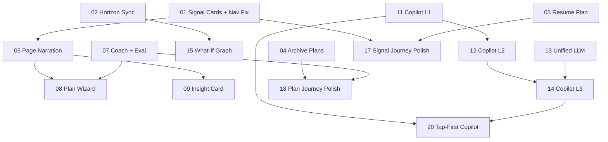

# Implementation Plan: End-to-End Playbook & Signal Journey Improvements

**Created:** 2026-02-27
**Status:** Not Started
**Total Features:** 20
**Completed:** 0/20

## Design Principle
Wealthsimple simplicity for everyday investors. Prism should feel like a knowledgeable friend who understands finance — not a trading terminal with a chatbot bolted on. The AI should *drive* the experience, not sit in a drawer waiting to be opened.

## Progress Summary

| ID | Feature | Status | Dependencies | Priority | Phase |
|----|---------|--------|--------------|----------|-------|
| 01 | Restore Signal Cards + Fix Navigation | ⬜ Not Started | - | High | 1 |
| 02 | Synchronize Horizon Across Graph & Sidebar | ⬜ Not Started | - | High | 1 |
| 03 | Resume Plan Indicator on Signal Detail | ⬜ Not Started | - | High | 1 |
| 04 | Archive Plans Instead of Delete | ⬜ Not Started | - | Medium | 1 |
| 05 | Page Narration Service + PrismNarration Component | ⬜ Not Started | 01 | High | 2 |
| 06 | Plain-English Graph Node Descriptions | ⬜ Not Started | - | Medium | 2 |
| 07 | Plan Coach Inline Feedback + Plain-English Eval | ⬜ Not Started | - | Medium | 2 |
| 08 | Prism-Guided Plan Builder (3-Step Wizard) | ⬜ Not Started | 05, 07 | High | 3 |
| 09 | Proactive Insight Card on Portfolio View | ⬜ Not Started | 05 | High | 3 |
| 10 | Do-Nothing Comparison Bar | ⬜ Not Started | - | Medium | 3 |
| 11 | Copilot Navigate + Explain (Level 1) | ⬜ Not Started | - | High | 4 |
| 12 | Copilot Navigate + Highlight (Level 2) | ⬜ Not Started | 11 | High | 4 |
| 13 | Unified LLM Copilot Proposals | ⬜ Not Started | - | High | 4 |
| 14 | Copilot Navigate + Act (Level 3) | ⬜ Not Started | 12, 13 | High | 4 |
| 15 | What-If Scenarios → Graph Re-render | ⬜ Not Started | 02 | Medium | 4 |
| 16 | Cross-Scope Intent Memory | ⬜ Not Started | - | Medium | 4 |
| 17 | Signal Journey Polish (Stories, Covered, Sticky CTA) | ⬜ Not Started | 01, 03 | Medium | 5 |
| 18 | Plan Journey Polish (Simplified Cards, Lifecycle) | ⬜ Not Started | 04, 07 | Medium | 5 |
| 19 | Backend Data Improvements (Prices, Ranges, Resolution) | ⬜ Not Started | - | Low | 5 |
| 20 | Tap-First Copilot (Decision Cards, Quick Replies, Guided Flow) | ⬜ Not Started | 11, 14 | High | 6 |

## Dependency Graph

## Phase Summary

### Phase 1 — Fix the Plumbing (Features 01-04)
Critical flow fixes: restore signal cards, fix broken navigation, sync horizons, resume plan indicator, archive support.

### Phase 2 — AI Narration Layer (Features 05-07)
Prism generates inline summaries on every page. Graph nodes get plain-English descriptions. Plan coaching comments appear in real-time.

### Phase 3 — Conversational Planning (Features 08-10)
3-step plan wizard with pre-built packages. Proactive insight card on portfolio. Do-nothing baseline always visible.

### Phase 4 — Navigating Copilot (Features 11-16)
Progressive copilot levels: navigate, highlight, act. Unified LLM proposals. What-if graph re-render. Cross-scope memory.

### Phase 5 — Polish & Lifecycle (Features 17-19)
Signal cards as stories. Simplified candidate cards. Post-plan lifecycle. Live prices and confidence ranges.

### Phase 6 — Tap-First Copilot (Feature 20)
Clickable prompt choices replacing typing. Decision cards, quick replies, guided flow steps.

## Status Legend

- ⬜ **Not Started** - Feature not yet begun
- 🔄 **In Progress** - Actively being worked on
- ✅ **Completed** - Feature finished and verified
- ⏸️ **Blocked** - Waiting on dependencies
- ⚠️ **Issues** - Requires attention

## Notes

- Original plan: `PLAN.md` in this directory
- UI mockups: `MOCKUPS.md` in this directory
- All features follow immutability patterns per project coding standards
- TDD required for all features with 80%+ coverage
