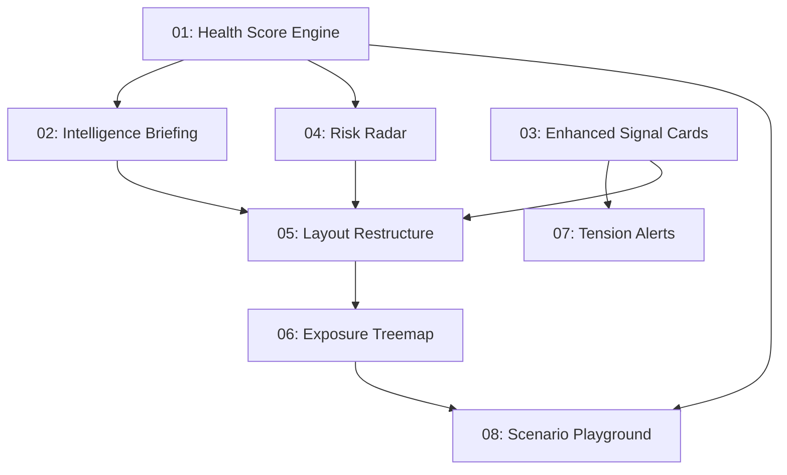

# Implementation Plan: Prism Homepage Redesign & Intelligence Features

**Created:** 2026-02-25
**Status:** Not Started
**Total Features:** 8
**Completed:** 0/8

## Context

The current Portfolio View is a passive asset list (holdings + pie chart + warnings). Prism's core value is proactive intelligence — revealing hidden risks, live market events, and causal impact. The homepage should feel like a living intelligence briefing, not a static balance sheet. The backend already produces rich intelligence (multi-horizon impact, temporal analysis, competing effects) that the frontend barely surfaces.

## Progress Summary

| ID | Feature | Status | Dependencies | Priority |
|----|---------|--------|--------------|----------|
| 01 | Portfolio Health Score Engine | ⬜ Not Started | - | High |
| 02 | Intelligence Briefing Hero | ⬜ Not Started | 01 | High |
| 03 | Enhanced Signal Cards with Dollar Impact | ⬜ Not Started | - | High |
| 04 | Risk Radar Sidebar | ⬜ Not Started | 01 | High |
| 05 | Homepage Layout Restructure | ⬜ Not Started | 02, 03, 04 | High |
| 06 | Exposure Treemap Visualization | ⬜ Not Started | 05 | Medium |
| 07 | Tension Alerts & Competing Effects | ⬜ Not Started | 03 | Medium |
| 08 | Scenario Playground | ⬜ Not Started | 01, 06 | Medium |

## Dependency Graph

## Parallel Tracks

### Track A: Intelligence Layer (Features 01 → 02, 04)
Build the health score engine first, then the briefing hero and risk radar that consume it.

### Track B: Signal Enhancement (Features 03 → 07)
Enhance signal cards with dollar impact, then add tension alerts for competing effects.

### Merge Point: Layout Restructure (Feature 05)
Combines outputs from both tracks into the new intelligence-first layout.

### Extensions (Features 06, 08)
Treemap visualization and scenario playground build on the new layout.

## Status Legend

- ⬜ **Not Started**
- 🔄 **In Progress**
- ✅ **Completed**
- ⏸️ **Blocked**
- ⚠️ **Issues**

## Notes

- Features 01 and 03 have no dependencies — can start in parallel
- Feature 05 is the integration point where the new layout comes together
- All features should preserve existing navigation to Impact Analysis and Ask Prism views
- Persistent disclaimer must remain on all screens
