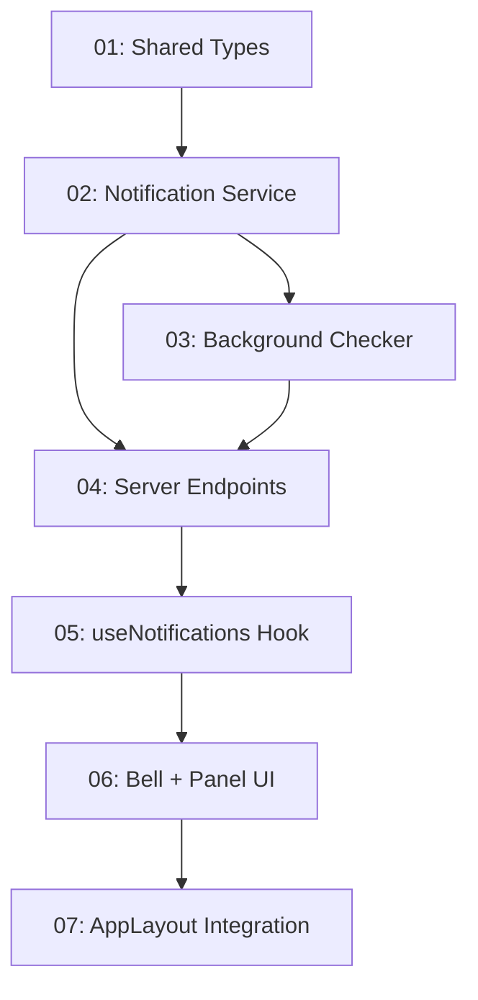

# Implementation Plan: Proactive Notification System

**Created:** 2026-02-26
**Status:** Not Started
**Total Features:** 7
**Completed:** 0/7

## Progress Summary

| ID | Feature | Status | Dependencies | Priority |
|----|---------|--------|--------------|----------|
| 01 | Shared Notification Types | ⬜ Not Started | - | High |
| 02 | Notification Service | ⬜ Not Started | 01 | High |
| 03 | Background Signal Checker | ⬜ Not Started | 02 | High |
| 04 | Server Endpoints (REST + SSE) | ⬜ Not Started | 02, 03 | High |
| 05 | useNotifications Hook (SSE Client) | ⬜ Not Started | 04 | High |
| 06 | Notification Bell + Panel UI | ⬜ Not Started | 05 | High |
| 07 | AppLayout Integration + Styles | ⬜ Not Started | 06 | High |

## Dependency Graph

## Status Legend

- ⬜ **Not Started** - Feature not yet begun
- 🔄 **In Progress** - Actively being worked on
- ✅ **Completed** - Feature finished and verified
- ⏸️ **Blocked** - Waiting on dependencies
- ⚠️ **Issues** - Requires attention

## Notes

- All features are on the critical path (linear dependency chain)
- Backend features (01-04) can be verified independently via curl
- Frontend features (05-07) require backend running
- Demo cadence: 1-minute polling, 5-minute notification cache TTL
