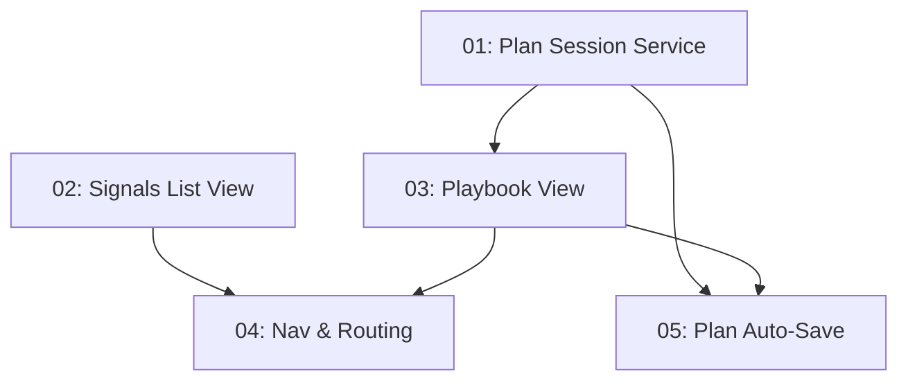

# Implementation Plan: Persistent Navigation Tabs + Playbook

**Created:** 2026-02-26
**Status:** Not Started
**Total Features:** 5
**Completed:** 0/5

## Progress Summary

| ID | Feature | Status | Dependencies | Priority |
|----|---------|--------|--------------|----------|
| 01 | Plan Session Types & Persistence Service | ⬜ Not Started | - | High |
| 02 | Signals List View | ⬜ Not Started | - | High |
| 03 | Playbook View | ⬜ Not Started | 01 | High |
| 04 | Navigation & Routing Update | ⬜ Not Started | 02, 03 | Medium |
| 05 | Plan Auto-Save & Session Restore | ⬜ Not Started | 01, 03 | Medium |

## Dependency Graph

## Parallel Tracks

### Track A: Backend (Feature 01)
⬜ Feature 01 (Plan Session Service)

### Track B: Frontend - Independent (Feature 02)
⬜ Feature 02 (Signals List View)

### Merge Point (Features 03, 04, 05)
⬜ Feature 03 → ⬜ Feature 04
⬜ Feature 05

**Note:** Features 01 and 02 can be built in parallel. Feature 03 depends on 01. Features 04 and 05 depend on 03.

## Status Legend

- ⬜ **Not Started** - Feature not yet begun
- 🔄 **In Progress** - Actively being worked on
- ✅ **Completed** - Feature finished and verified
- ⏸️ **Blocked** - Waiting on dependencies
- ⚠️ **Issues** - Requires attention

## Notes

- Plan sessions use JSON file storage (same pattern as workspace-session-service)
- "Playbook" is the user-approved name for the saved plans tab
- Progressive flow (Portfolio → Signal → Plan) still works alongside tab navigation
- Auto-save is debounced at 1s to avoid flooding the server

---

**Last Updated:** 2026-02-26
