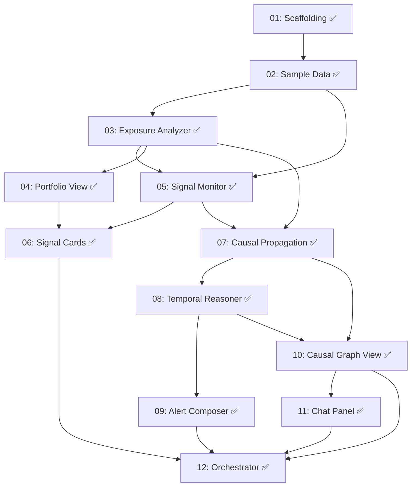

# Implementation Plan: Prism — AI-Native Portfolio Intelligence System (Prototype)

**Created:** 2026-02-24
**Status:** Completed
**Total Features:** 13
**Completed:** 13/13

## Progress Summary

| ID | Feature | Status | Dependencies | Priority | Track |
|----|---------|--------|--------------|----------|-------|
| 01 | Project Scaffolding & Core Infrastructure | ✅ Completed | - | High | Foundation |
| 02 | Sample Data Layer | ✅ Completed | 01 | High | Foundation |
| 03 | Exposure Analyzer Agent | ✅ Completed | 02 | High | Backend |
| 04 | Portfolio View — Holdings & X-Ray | ✅ Completed | 03 | High | Frontend |
| 05 | Signal Monitor Agent (Live via Gemini Search Grounding) | ✅ Completed | 02, 03 | High | Backend |
| 06 | Signal Cards on Portfolio View | ✅ Completed | 04, 05 | High | Frontend |
| 07 | Causal Propagation Engine Agent | ✅ Completed | 03, 05 | High | Backend |
| 08 | Temporal Reasoner Agent | ✅ Completed | 07 | High | Backend |
| 09 | Alert Composer Agent & Personalization | ✅ Completed | 08 | Medium | Backend |
| 10 | Causal Graph View — D3.js Visualization | ✅ Completed | 07, 08 | High | Frontend |
| 11 | Chat Panel — Contextual Drawer | ✅ Completed | 10 | High | Frontend |
| 12 | Orchestrator & End-to-End Demo Flow | ✅ Completed | 06, 09, 10, 11 | High | Integration |
| 13 | Portfolio-Net Impact Mode + Signal Drill-Down | ✅ Completed | 05, 07, 08, 10, 12 | High | Integration |

## Dependency Graph

## Parallel Tracks

### Track A: Foundation (Features 01-02)
✅ 01 → ✅ 02

### Track B: Backend Agent Pipeline (Features 03, 05, 07, 08, 09)
✅ 03 → ✅ 07 → ✅ 08 → ✅ 09
✅ 05 ↗ (merges into 07)

### Track C: Frontend (Features 04, 06, 10, 11)
✅ 04 → ✅ 06
✅ 10 → ✅ 11

### Track D: Integration (Feature 12)
✅ 12 (merges all tracks)

## Milestones

- [x] **M1: Foundation Ready** (Features 01-02) — Project runs, sample data accessible
- [x] **M2: Exposure Engine Working** (Feature 03) — Can decompose holdings into true exposure
- [x] **M3: Portfolio View Renders** (Feature 04) — User sees holdings + X-Ray
- [x] **M4: Signal Pipeline Active** (Features 05, 07, 08) — Live events generate causal chains with temporal classification
- [x] **M5: Full UI Flow** (Features 06, 10, 11) — Portfolio View → Graph → Chat navigation works
- [x] **M6: Demo Ready** (Feature 12) — End-to-end live signal flow works any day

## Risks

| Feature | Risk | Mitigation | Status |
|---------|------|------------|--------|
| 07 | Gemini causal chain output may not match expected JSON schema | Define strict schema + validation + retry with corrective prompt | ✅ Mitigated — Zod validation-retry loop implemented |
| 10 | D3.js graph layout with 15-20 nodes may be hard to read | Node clustering + deterministic rank layout + depth toggle implemented | ✅ Mitigated |
| 11 | Chat context window may exceed limits with full causal chain | Summarize chain context; send only relevant subgraph to LLM | ⬜ |
| 05 | Google Search grounding may return noisy/irrelevant results | Filter by relevance to user's ExposureMap; require source citations | ✅ Mitigated — prompt scoped to user's top exposures + relevance threshold |
| 12 | Agent orchestration timing — live signals must sync with UI | Use event-driven architecture; loading states for async LLM calls | ⬜ |

## Known Divergences from PRD

- **Concentration percentages lower than projected:** Top-N fund holdings (~45-70% coverage) yield ~17% Canadian Financials vs. PRD's 38%. Full constituent data needed for production accuracy. See `docs/learnings/03-exposure-analyzer.md`.
- **Agent framework:** Google ADK TypeScript SDK is now integrated (`@google/adk`) while retaining modular domain-agent functions as ADK tool implementations.
- **LLM model:** Using Gemini 3.0 Pro Preview after Gemini 2.0 Flash became unavailable to new users.
- **Signal materiality thresholding:** Feature 06 currently uses deterministic urgency+relevance scoring in frontend utility functions; this will be replaced by Alert Composer personalization logic in Feature 09.
- **Temporal Reasoner implementation:** Feature 08 currently uses deterministic scoring + multi-horizon heuristics for reliability; optional LLM enrichment can be layered in later.

## Notes

- Prototype uses pre-loaded sample data for portfolios/funds, but LIVE market signals via Gemini Google Search grounding
- 2-3 sample user profiles for personalization contrast
- Signals are not scripted — system reacts to whatever is currently in the news, scoped to user's top exposures
- All analysis screens must display the regulatory disclaimer (PRD Section 9)
- Learning docs for each completed feature in `docs/learnings/`

---

**Created:** 2026-02-24
**Last Updated:** 2026-02-26
