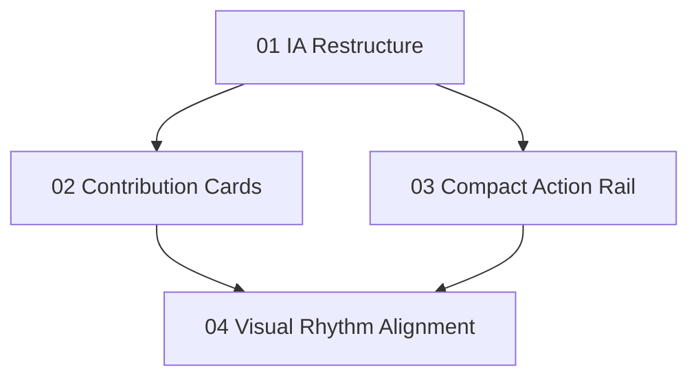

# Implementation Plan: Signals All Control Tower Redesign

**Created:** 2026-02-27
**Status:** Completed
**Total Features:** 4
**Completed:** 4/4

## Progress Summary

| ID | Feature | Status | Dependencies | Priority |
|----|---------|--------|--------------|----------|
| 01 | Reframe All-page information architecture | ✅ Completed | - | High |
| 02 | Build medium-detail contribution cards | ✅ Completed | 01 | High |
| 03 | Refactor right rail to compact action rail | ✅ Completed | 01 | High |
| 04 | Align spacing/visual rhythm with Portfolio | ✅ Completed | 01,02,03 | High |

## Dependency Graph

## Notes
- Preserve existing signal drill-in and chip navigation behavior.
- Do not add backend dependencies.
- Keep this page visually distinct from Portfolio exposure/inventory surfaces.
