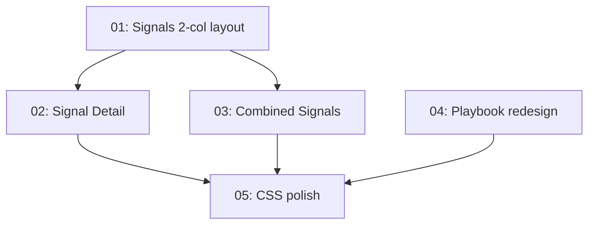

# Implementation Plan: Signal Detail + Playbook Redesign

**Created:** 2026-02-27
**Status:** Not Started
**Total Features:** 5
**Completed:** 0/5

## Progress Summary

| ID | Feature | Status | Dependencies | Priority |
|----|---------|--------|--------------|----------|
| 01 | Signals 2-col layout + chip strip | ⬜ Not Started | - | High |
| 02 | Signal Detail impact-first + path insight | ⬜ Not Started | 01 | High |
| 03 | Combined Signals pane update | ⬜ Not Started | 01 | High |
| 04 | Playbook focused decision flow | ⬜ Not Started | - | High |
| 05 | CSS polish + verification | ⬜ Not Started | 01, 02, 03, 04 | Medium |

## Dependency Graph

## Design Principles

- **Signal Detail**: Inform users about signals impacting their holdings → prompt them to act via the Playbook.
- **Playbook**: Given the signal impacts, recommend securities that help mitigate → explain why → let the user decide.
- **Wealthsimple layout**: Wide main column (~65-70%) + narrower sidebar (~30%). Generous whitespace. White cards on warm gray bg. 14px rounded corners.

## Status Legend

- ⬜ **Not Started**
- 🔄 **In Progress**
- ✅ **Completed**
- ⏸️ **Blocked**

## Notes

- Signal list panel (280px left column) replaced by horizontal chip strip
- NodeDetailSheet bottom modal replaced by inline Path Insight section
- PlanView reasoning graph becomes collapsible
- All pages match Wealthsimple proportions: wide main + narrow sidebar
