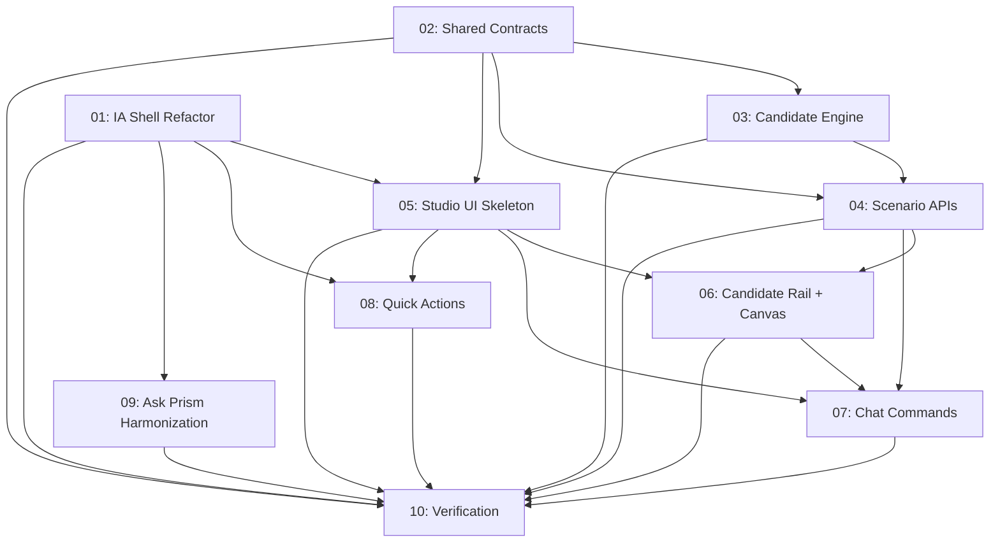

# Implementation Plan: Strategy Studio Closed-Loop Portfolio Response

**Created:** 2026-02-26
**Status:** In Progress
**Total Features:** 10
**Completed:** 9/10

## Progress Summary

| ID | Feature | Status | Dependencies | Priority |
|----|---------|--------|--------------|----------|
| 01 | Impact Analysis Shell Refactor (Subviews) | ✅ Completed | - | High |
| 02 | Shared Strategy Contracts and Types | ✅ Completed | - | High |
| 03 | Mitigation Candidate Engine | ✅ Completed | 02 | High |
| 04 | Scenario Simulator and Strategy APIs | ✅ Completed | 02, 03 | High |
| 05 | Strategy Studio UI Skeleton | ✅ Completed | 01, 02 | High |
| 06 | Candidate Rail + Drag/Drop Canvas + Evaluate Loop | ✅ Completed | 04, 05 | High |
| 07 | Chat-Driven Draft Generation and Scenario Commands | ✅ Completed | 04, 05, 06 | High |
| 08 | Drill-down Right Panel Simplification to Quick Actions | ✅ Completed | 01, 05 | Medium |
| 09 | Ask Prism Entry Harmonization (Desktop + Mobile) | ✅ Completed | 01 | Medium |
| 10 | Verification, Hardening, and Demo Narrative Updates | 🔄 In Progress | 01-09 | High |

## Dependency Graph

## Parallel Tracks

### Track A: Refactor Foundation
- 01 and 02 can proceed in parallel

### Track B: Backend Strategy Core
- 03 then 04

### Track C: Frontend Strategy Experience
- 05 then 06 then 07

### Track D: UX Cleanup
- 08 and 09 after 01 (09 can run in parallel with 05/06)

### Finalization
- 10 after all feature slices stabilize

## Status Legend

- ⬜ Not Started
- 🔄 In Progress
- ✅ Completed
- ⏸️ Blocked
- ⚠️ Issues

## Notes

- Keep no-trade automation boundary explicit through all flows.
- Prefer deterministic computation for scenario scoring in MVP.
- Preserve current signal and node context when switching subviews.
