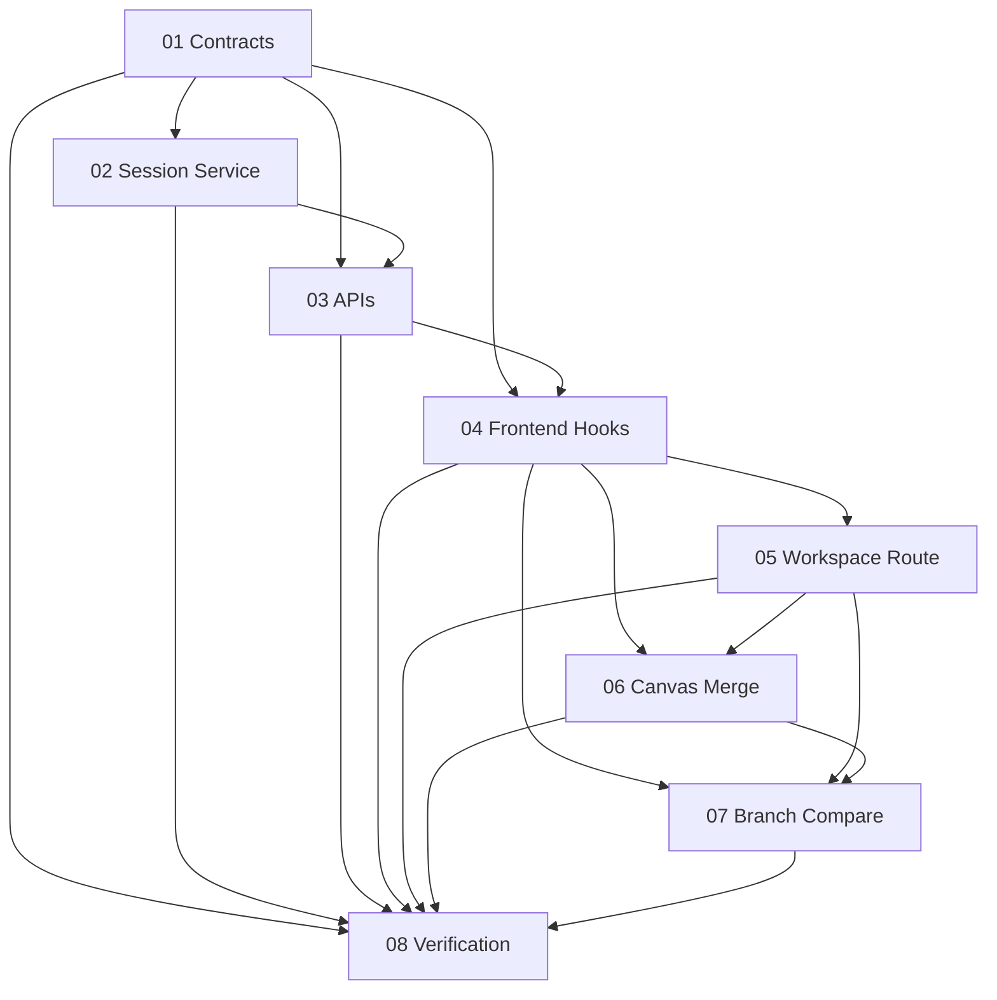

# Implementation Plan: Unified Prism Workspace

**Created:** 2026-02-26
**Status:** Completed
**Total Features:** 8
**Completed:** 8/8

## Progress Summary

| ID | Feature | Status | Dependencies | Priority |
|----|---------|--------|--------------|----------|
| 01 | Shared workspace contracts and exports | ✅ Completed | - | High |
| 02 | Server workspace session service + retention | ✅ Completed | 01 | High |
| 03 | Workspace session APIs + graph expand API | ✅ Completed | 01, 02 | High |
| 04 | Frontend workspace data hooks/state | ✅ Completed | 01, 03 | High |
| 05 | Unified workspace route + shell layout | ✅ Completed | 04 | High |
| 06 | Infinite canvas integration + mitigation merge | ✅ Completed | 04, 05 | High |
| 07 | Branch sessions + compare mode UI | ✅ Completed | 04, 05, 06 | Medium |
| 08 | Verification and regression fixes | ✅ Completed | 01-07 | High |

## Dependency Graph

