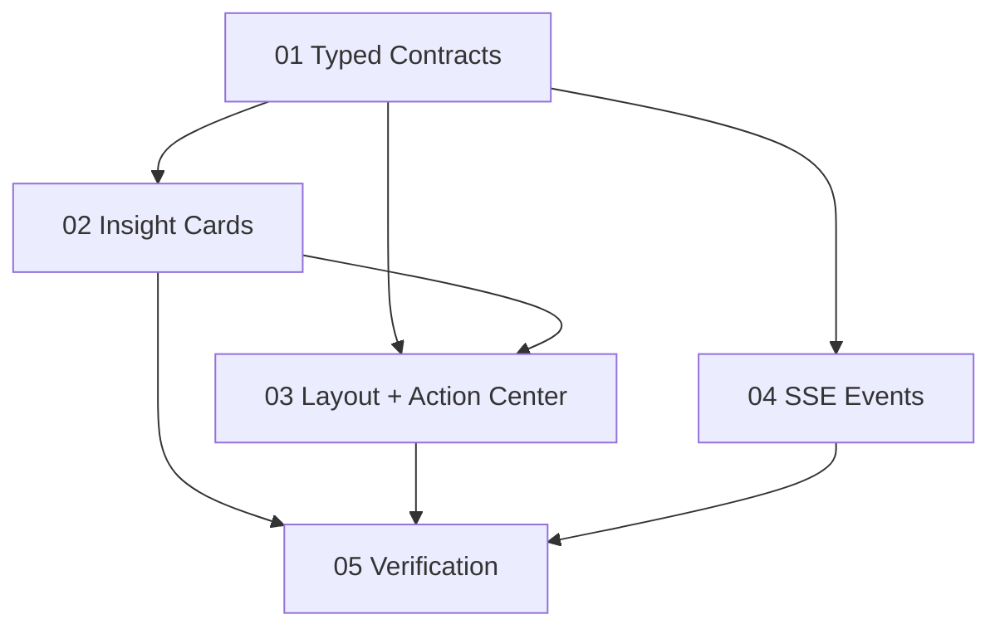

# Implementation Plan: Frontend Explorer + Playbook + Trace

**Created:** 2026-02-28
**Status:** In Progress
**Total Features:** 5
**Completed:** 0/5

## Progress Summary

| ID | Feature | Status | Dependencies | Priority |
|----|---------|--------|--------------|----------|
| 01 | Typed Card Contracts + Mapping | 🔄 In Progress | - | High |
| 02 | Progressive Insight Cards | ⬜ Not Started | 01 | High |
| 03 | Dual-Pane Layout + Action Center | ⬜ Not Started | 01,02 | High |
| 04 | Additive SSE Events (Analyze API) | ⬜ Not Started | 01 | High |
| 05 | Verification + Regression Review | ⬜ Not Started | 01,02,03,04 | High |

## Dependency Graph

## Notes
- No removal of existing card types/events; additive compatibility only.
- Keep manual execution boundary (checklist, no trading automation).
