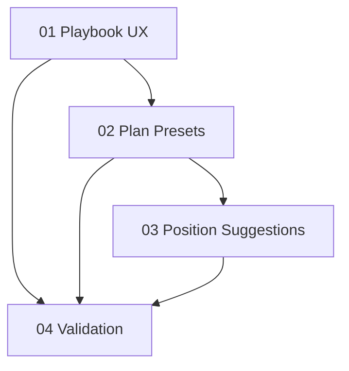

# Implementation Plan: Playbook UX + Position Suggestions

**Created:** 2026-02-27
**Status:** Completed
**Total Features:** 4
**Completed:** 4/4

## Progress Summary

| ID | Feature | Status | Dependencies | Priority |
|----|---------|--------|--------------|----------|
| 01 | Playbook List UX Enhancements | ✅ Completed | - | High |
| 02 | Plan Presets + Allocation Workflows | ✅ Completed | 01 | High |
| 03 | Candidate Dollar/Share Position Suggestions | ✅ Completed | 02 | High |
| 04 | Validation + Review Pass | ✅ Completed | 01,02,03 | High |

## Dependency Graph

## Notes
- Keep all existing functionality (rename/delete/list/grid/navigation).
- Avoid introducing dependencies on live quote providers for now.
